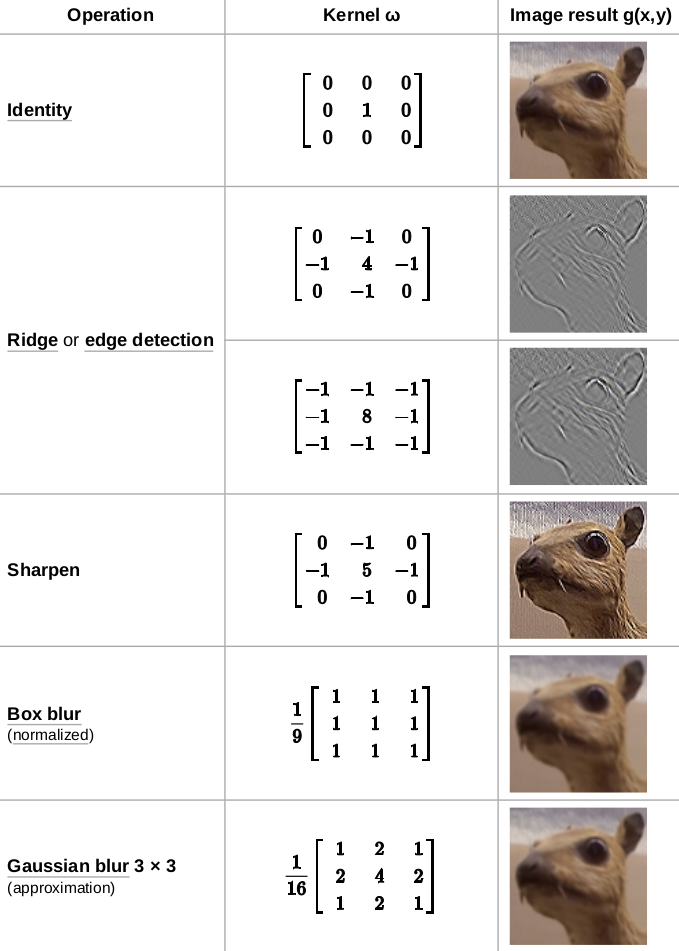
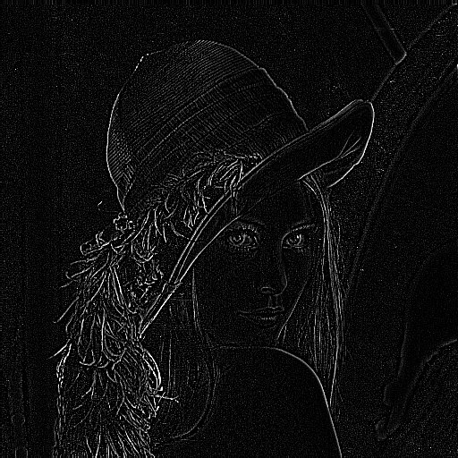

# Image Processing using OpenCV

## Overview
This project applies image processing techniques to the classic Lena image using OpenCV and NumPy. It demonstrates edge detection and Gaussian blurring through convolution operations with custom kernels.

## Features
- **Edge Detection**: Uses a sharpening kernel to enhance edges.
- **Gaussian Blur**: Applies a weighted kernel to smooth the image.
- **Image Display & Saving**: The processed images are saved and displayed for comparison.



## Usage
1. Place `Lena.png` in the same directory as the script.
2. Run the script:

```bash
python image.py
```
3. The processed images will be saved as:
   - `edge_detection.png`
   - `gaussian_blur.png`

## Results
| Original | Kernel 1 | Kernel 2 |
|----------|----------|----------|
|  |  |  |


